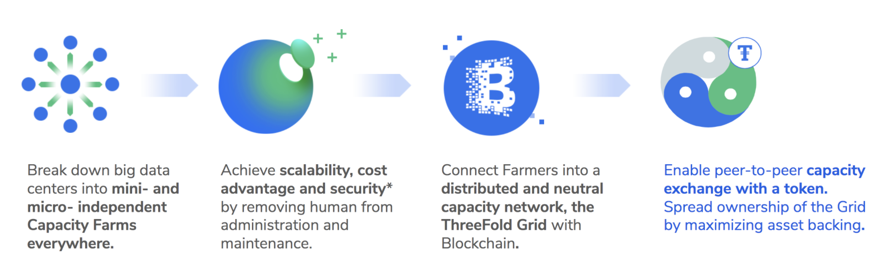

# The ThreeFold Grid: A High Level Introduction

Originally the internet was intended to be fully peer2peer, today thats not the case. Few datacenters in centralized locations deliver all the capacity for the current internet. This capacity is mainly storage & compute capacity.
ThreeFold wants to restore this situation.

The ThreeFold Grid is a platform on which any internet experience (or service) can be built on.

- Any application which can run on linux (which is +- all) can run on top of the TFGrid.
- There are already more than 20 projects who are committed to run their workloads on top of the TFGrid.

A dedicated digital currency called TFT has been created to allow anyone to sell/buy this IT capacity (Storage,Compute, Network).

#### The ThreeFold grid is active

TFGrid today has:

- +18000 CPU cores 
- +90,000,000 GB of online storage

TFGrid is the largest peer-to-peer network of Internet (compute, storage and network) capacity in the world. The sum of all IT capacity in the TFGrid is larger than the sum of all IT capacity as used for all blockchain projects (May 2020). This may sound a lot but actually its still small compared to the massive centralized cloud vendors.

The system is not distributed enough yet, there are only 50-60 locations, more farmers are needed to grow the grid to its full potential.

The ThreeFold Grid needs computers (servers) to function. Servers of all shapes and sizes can be added to the ThreeFold Grid, by anyone, anywhere in the world. Zero-OS is an opensource operating system which needs to be run on the servers to make them extend the grid. People who add these computers to the grid are called farmers. This is a fully decentralized process, farmers downloads the Zero-OS operating system and boot their servers (3nodes). The 3nodes will register themselves in a database called TFDirectory and TFGrid users can then find the capacity they need to run their applications.

#### How mature is the TFGrid?

- Our Zero-OS is beta quality and is at 2nd major release.
- The workloads can be registered using json format for our smart contract for IT layer.
- Experts can use any development language to use the grid as is by using this smart contract for IT layer.
- We can use some help to improve the documentation though.

#### There is also an automation layer called 3bot

- 3bot is your virtual system administrator (see http://sdk.threefold.io)
- Its a very powerful tool to allow you to automate & manage thousands of virtual workload.
- Python language can be used to extend this tool and make it your own.
- This software is beta quality but usable for production, be reminded that the workload itself is running on Zero-OS and the smart contract for IT layer which is production quality.
- There is a new exciting version of it called 2.2, which has a super nice UI and user friendly wizards. Launching now in Summer 2020.

