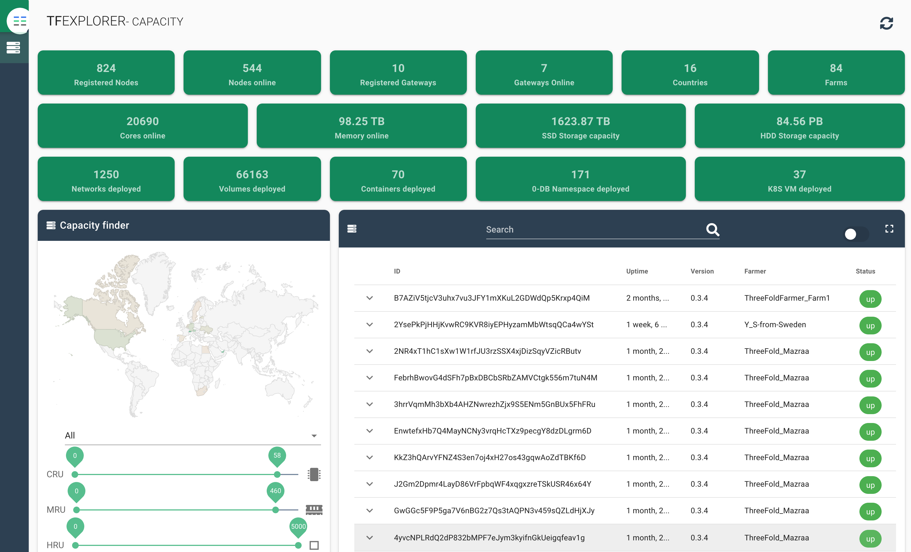

# ThreeFold 

Snapshot from 21-June 2020, for updated info see https://explorer.grid.tf/

We don't see ourselves as competing with infrastructure blockchain projects, we want to help and together we can deliver a new internet.

> All projects below can run on top of our grid ! You can consider us as a layer between the hardware and many blockchain projects.

## is this a lot of capacity?

ThreeFold has probably more capacity online compared to the sum of all infrastructure blockchain projects.
Which sounds like a lot but its only the beginning, we are only in 17 countries and not enough locations.

> Please note this does not say much because the commercial cloud providers have probably thousands of times this amount today.

If anyone knows more details or we have forgotten a party please let us know.

ThreeFold capacity can be consulted on https://explorer.grid.tf/

### Compute

- Golem (https://golem.network/) : very cool project, can run on top of our grid
  - run wasm binaries on other computers
  - GPU workloads
  - working on more generic workloads as well
- HoloChain : pre-release, potential to have your data linked to you
  - testnet is up, runs on top of TFGrid
- https://hypernetwork.io/ mainly data driven workloads, very well packaged, could run on our grid
  - unknown how to become a miner/farmer of this, capacity unknown
  - we will reach out to them, would be ideal to host this project on top of TFGrid
- https://constellationnetwork.io/
  - we will reach out to them, would be ideal to host this project on top of TFGrid
  - today hosted in more centralized manner on "stackpath"
- https://sonm.com/
  - gpu and other workloads, usable today, looks like not that much capacity active yet (https://sonm.com/sonm-os/)
  - can run on top of TFGrid

Most of the compute workloads are not really what we do, we are a layer underneath where would be more than happy host them.

### Storage

- https://sia.tech/: 2 PB (PetaByte)
- FileCoin: not active yet, see https://filecoin.io/mine/#intro  (*)
- StorJ/tardigrade.IO (not production yet): unknown, but 1 year ago was less than 1 PB

ThreeFold has more than 90PB 

*(*) there is a peer2peer network called IPFS which is the predecessor, but we believe this not to be usable yet for production storage workloads*
- 

### other projects

- there are lots of smart contract or application development platforms, but that is not what we do.
- bloq, blockstack, eos, ethereum, ...
- all of these would be a perfect workload for our grid.

