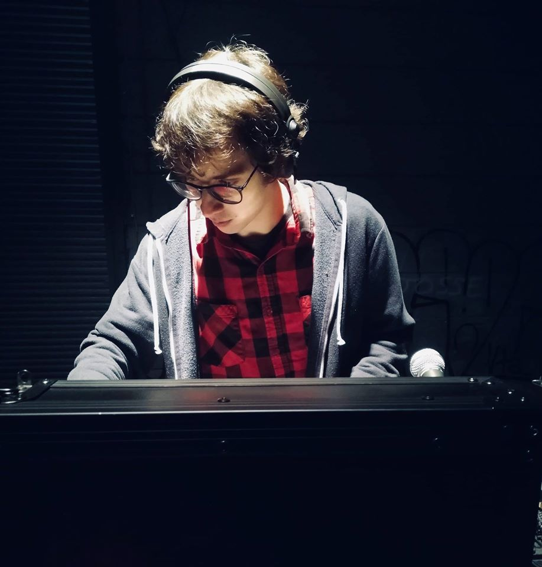

# Maxime Daniel - @maxux

I'm passionate by programming since I'm 10. I always had this passion to build something to help
me or people to achieve doing things we want, easier, faster and more accessible. My contribution to ThreeFold
is, in my opinion, completly in line with my passion and what I try to achieve daily, but in a large scale:
make the world better by writing software to help people and the planet.

I like doing choice I think right and control my life, not let my life being controlled by others. I think
privacy and equity is important to everyone and fair.

By contributing to Zero-OS and side projects, like 0-db, 0-flist, 0-initramfs, ... I think lot of my life goals
are achieved in a right way.

