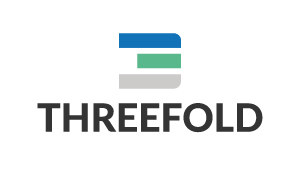
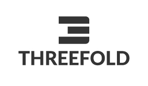

# ThreeFold Brand Collateral

## ThreeFold Logos

We have a few different styles of our logo.
We prefer using the colored logo's with the white or white typography.

**Horizontal versions:**

(White colored versions also available)

**Vertical versions:**

(White colored versions also available)

**Icon's only:**

(White colored versions also available)

[***All logo's can be downloaded here***](https://drive.google.com/drive/folders/1C3olGDE1aTGpvS069OOoqt9bNyff3EBt?usp=sharing)
## ThreeFold Colors

The main colors of our logo are.

### 3-Blue:
**RGB:** 18/114/84

**#:** 1272B8

**CMYK:** 98/43/0/0

### 3-Green:
**RGB:** 89/184/140

**#:** 59B88C

**CMYK:** 79/0/59/0

### 3-Gray:
**RGB:** 204/203/202

**#:** CCCBCA

**CMYK:** 0/0/0/26

### Monochrome logo's and Type Colors
**White:**
**RGB:** 255/255/255

**#:** FFFFFF

**CMYK:** 0/0/0/0

**Black:**
**RGB:** 52/52/52

**#:** 343434

**CMYK:** 0/0/0/94%