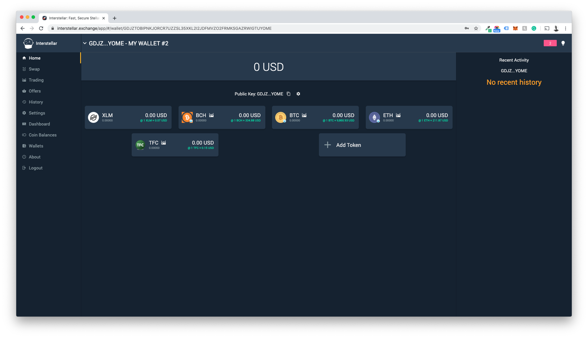
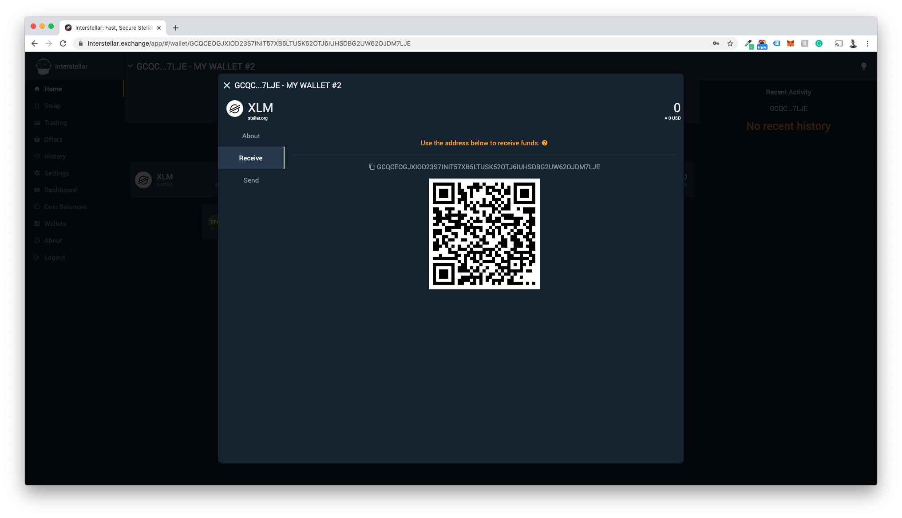
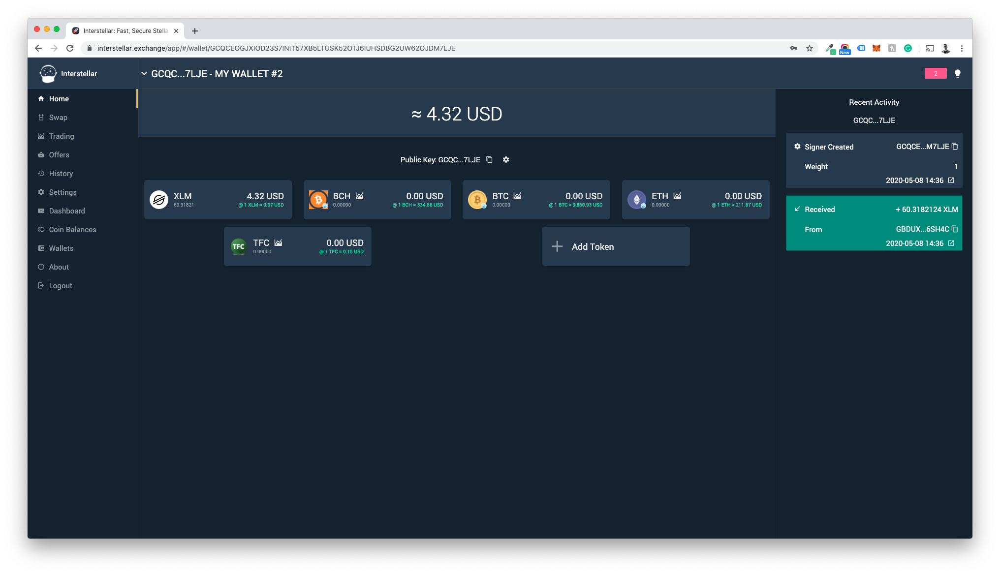
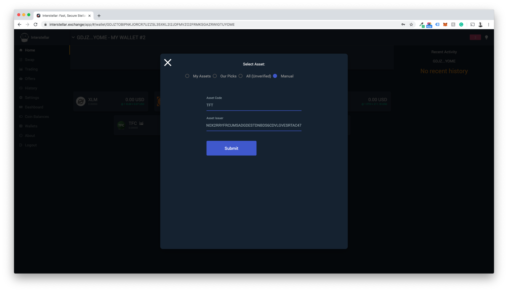
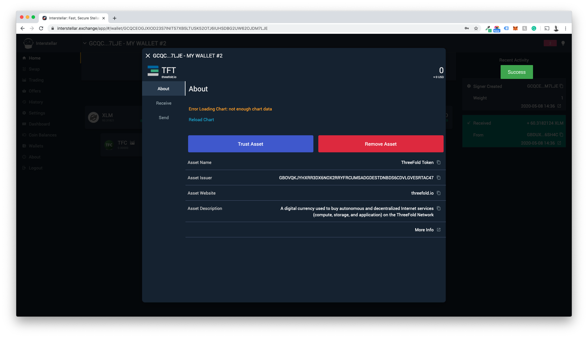
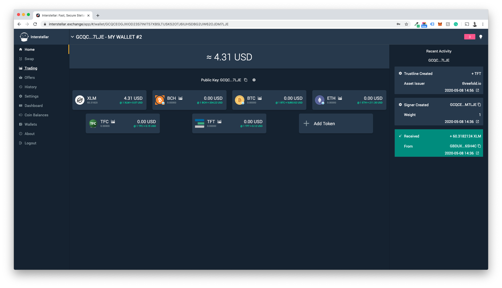
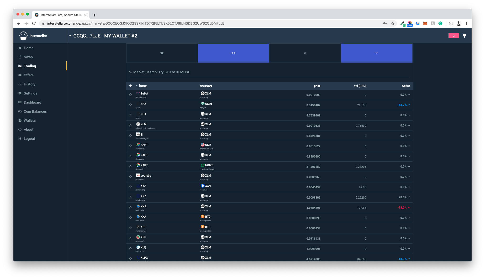
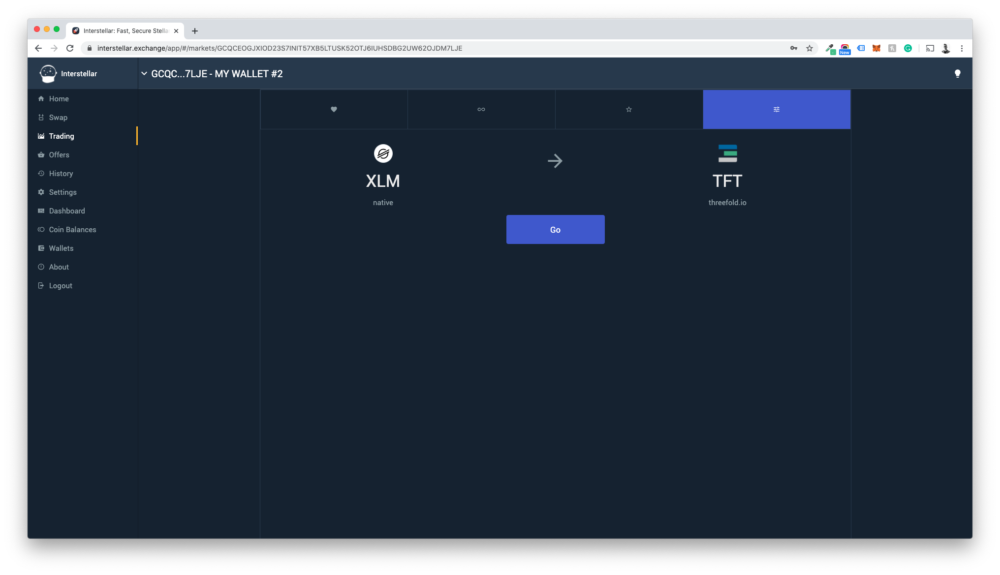
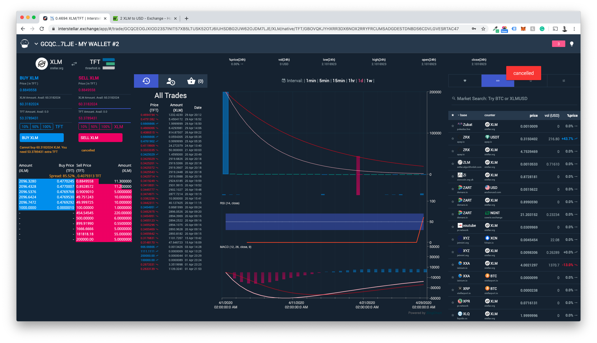

# Buying Branded TFT

## Step 1: Going from FIAT money into digital currencies

If you are new to buying digital currencies, this step is for you as you are about to step into the world digital currencies. (excited!)

For this example we will use a well known and renowned digital currency exchange that has a gateway from FIAT to digital currencies: www.Coinbase.com

1. Create an account on the sign up page : [https://www.coinbase.com/signup](https://www.coinbase.com/signup)

2. After signing up a few steps will be presented. Like GDPR compliance notice, privacy policy acknowledgment, and newsletter preferences.

3. After this step, it is required you verify your email address.

4. After verifying you will have to add a telephone number to receive confirmation sms messages on.

5. After clicking Send code you will have to fill in the code received in the text sent by coinbase

6. Coinbase by law as to ask and verify your identity, these are the last steps to take.
Make sure all information provided is correct as stated on your ID.

7. To verify your input Coinbase will need you to upload a valid ID. (these options can differ per user).

8. For uploading purposes there are 3 options; webcam, phone camera & file upload. For this example we have used the webcam option to send both the fron and back of the ID.

9. Coinbase will now verify your documents; this might take up to a few minutes.

You are now Onboarded

## 
Loading you account

1. Visit: [https://www.coinbase.com/dashboard](https://www.coinbase.com/dashboard) and click trade

2. Add your preferred payment method (in the example below we show a bank transfer). 
Specify:
- Bank Name
- Account Holder Full Name
- Amount

3. Write down the reference number displayed 

4. Wire the amount from the specified account to the details shown (this may differ from what is shown in this wiki entry).

5. Wait for the funds to appear in your account. This may take a while and by the time it does Coinbase normally sends the account holder an email.

## Exchanging your FIAT for digital currency.

For this part of the manual we unfortunately cannot provide any screenshots other than the ones on display (Dutch Language) as this setting seems to be tied to the account holder’s nationality.

For ease of trading we are buying XLM (Stellar) tokens. This makes steps to come easier.

1. Click Trade

2. Chose XLM and the wallet you wish to buy them with (euro’s wallet in this case)

3. Click Preview sale

4. Click buy now if you agree with the sale preview

5. The XLMs bought will now show up in your wallets section

## Creating an account on Interstellar and Funding it.

1. Insert part 1 of Trading on interstellar. + generate a random wallet.

2. In your wallet click the XLM logo

3. Click Receive

4. Copy the wallet address and go back to Coinbase

5. Click Stellar Lumens in your wallet section

6. On the right hand side of your screen you can now fill in:
- The amount you want to send to your interstellar wallet
- Paste the address of your interstellar wallet in
- Give a memo (can be anything, but is needed to process)

7. Click send and fill in the two-factor authentication code

8. Funds are now sent and showing up in Interstellar wallet

# Adding the asset you would like to buy to your wallet.

1. Pick the asset you would like to add
	
**_We need the assetcodes and issuers for each
_**

2. Click Add Token in your interstellar wallet and go to the manual tab. (for this example we use TFT but this process will not differ with any other assets).
- Paste in the Asset name and Asset Issuer. Click Submit.

3. Setup a trustline with the asset (this will cost approx 1.5 XLM)
- Click Trust Asset

- Confirm with your password

- When successful you will see "Succes" Show up 

- Asset is now added to your wallet

## Trading your XLMs for another Asset

1. Click "Trading" in the menu

2. Click the most right tab in the trading menu to select your pairs

3. Select XLM to TFT (fastest from "my assets")

4. Put buy order into the order book.	
We will also make sure when the TDE has started that the order book has sell-order for you to fullfil to go quickly.  

