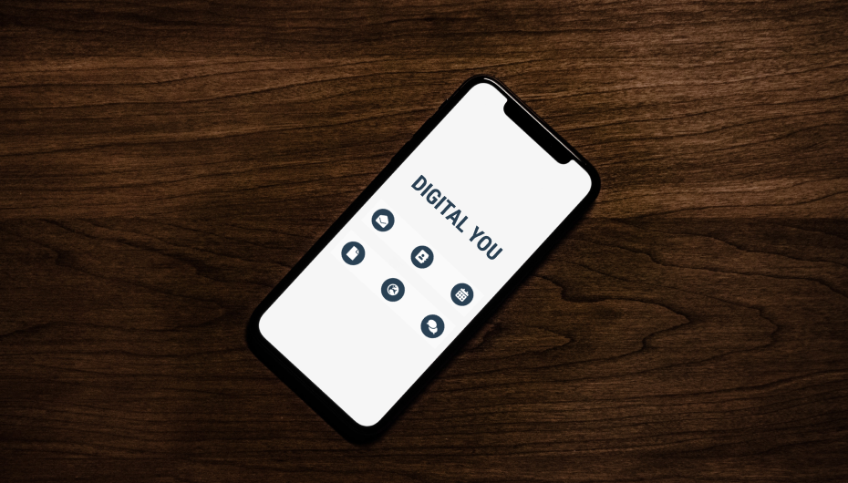
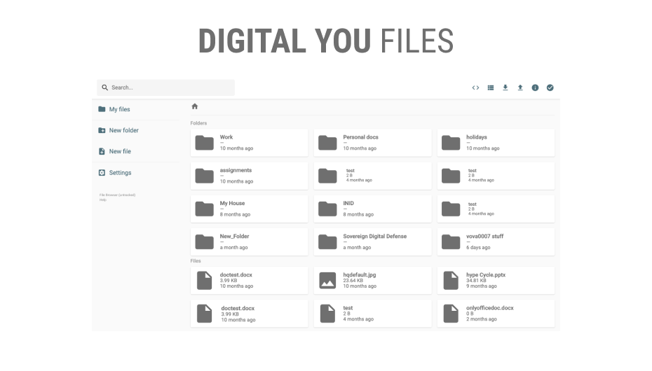
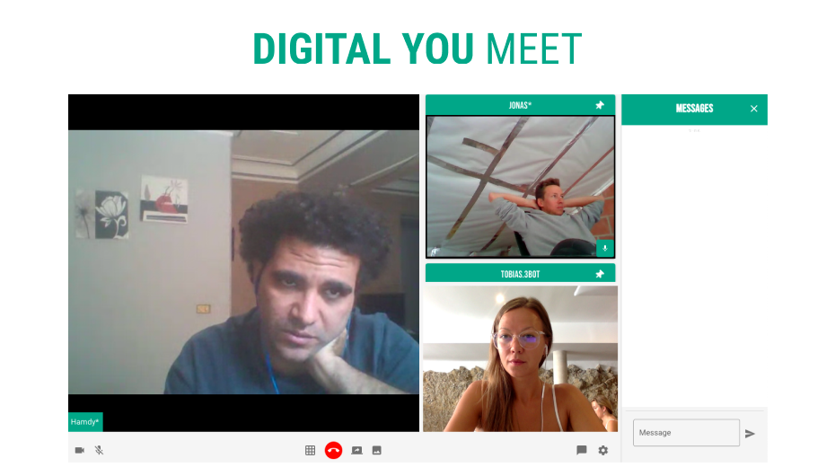
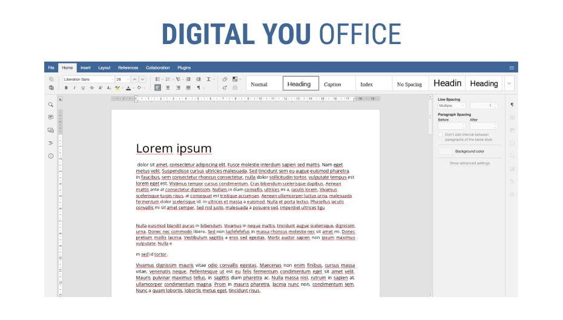
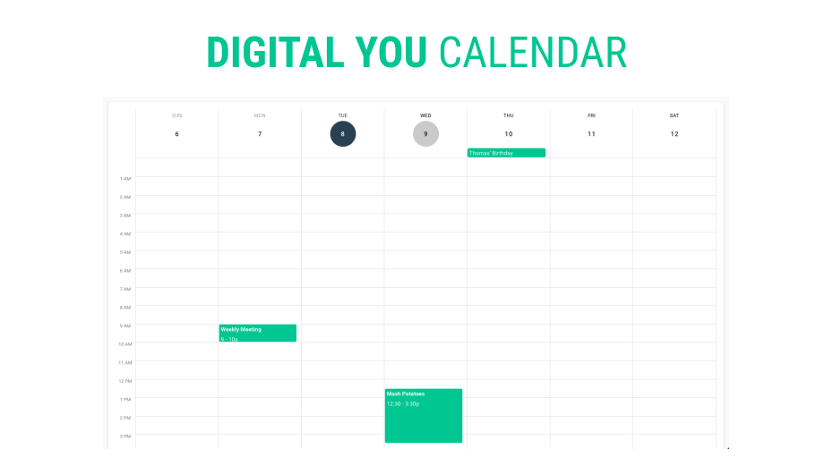
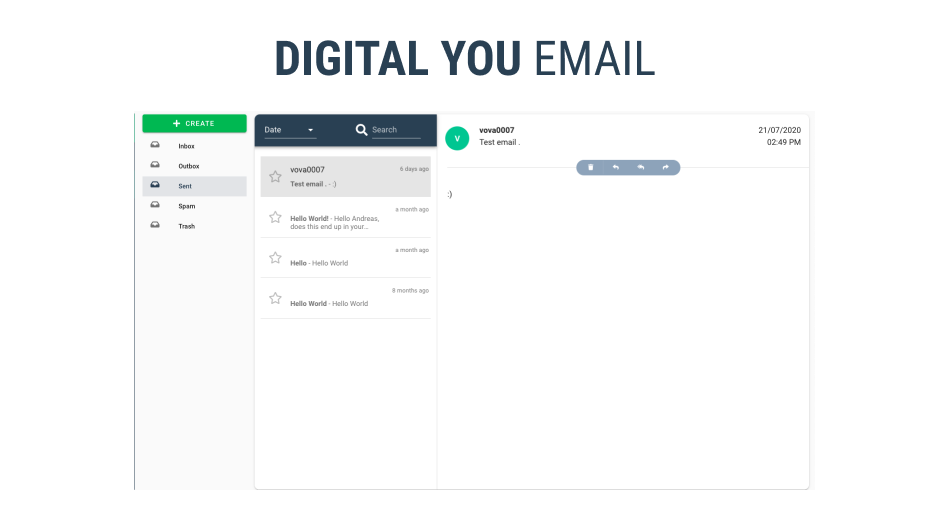

# Digital You

*The Digital You* is the basic tool layer of your personal digital twin (see [Crystal Twin](crystaltwin.md) project) allowing you to run your workloads, communication, applications, well.. any basic digital functions self hosted on a private network per your choosing in a true decentralized manner.

### Purpose

Bringing a fully decentralized platform with growing number of tools that provides full authority on users activities and full ownership of data created, edited and stored.
Integrated with 3bot connect as users own personal system adiminstrator and hosted on overlay IPV6 network on top of Threefold  Grid, a true peer-to-peer network.

### Status Today

Digital You as per today has following tools and features in demo version:

- [Digital You Files](digitalyoufiles.md)

- [Digital You Browser](digitalyoubrowser.md)

- [Digital You Meet (video conferencing)](digitalyoumeet.md)

- [Digital You Office](digitalyouoffice.md)

- Digital You Calendar

- Digital You Email

Please see: [Digital You test/demo space](https://threebotdemo.jimber.org/)

### Team

- [Kristine Vilnite](https://www.consciousinternet.org/#/people/kristine_vilnite) (Digital You)
- [The Jimber Team](https://www.jimber.org/contact.html) (Browser, Meet, Calendar, Contacts, Email)
- Hamdy (Files, Office)

### Funding

- Funding needed for next milestones as described below: 13,000,000 TFT

### Milestones

| Name         | Date   | Funding needed (TFT) | Description |
|:-------------|--------|--------|-------------|
| [Files](digitalyoufiles.md) | Q3 2020 | 3,000,000 | Provide functionality to store (personal) files in a secure and private way |
| [Browser](digitalyoubrowser.md) | Q3 2020 | 3,000,000 | Personal browser running close to our 3bot |
| [Meet](digitalyoumeet.md) | Q3 2020 | 2,000,000 | Video conferencing tool, alternative to zoom |
| [Office](digitalyouoffice.md) | Q3 2020 | 5,000,000 | 100% compatible office suite running on top of your 3bot |
| E-mail| Q3 2020 | n/a |  |
| Calendar | Q3 2020 | n/a |  |