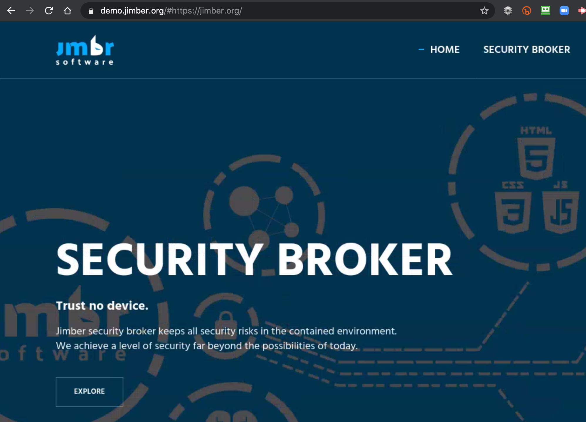
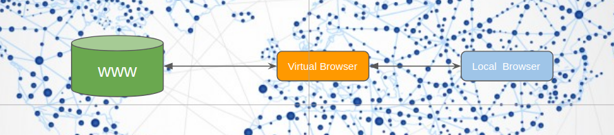

# Digital You Browser

*The Digital You Browser* is a browser that runs close to your digital twin - Crystal Twin. It presents you with the ability to have a browser on the ThreeFold Grid running anywhere you want and to securely stream the content back to your local browser.  

### Purpose

A lot of hacking happens in your current browser, but this won't be possible with Digital You browser. Millions of people are looking for a browser solution which is:
- neutral 
- allows you to own all your data
- faster, simple to use
- cost-effective
- able to work everywhere
- has advanced features like real time collaboration

### Status Today

- We have a full blown first version active and ready to be launched
- We are now fundraising to make the next generations

### Team

- [The Jimber Team](https://www.jimber.org/contact.html)

### Funding

- Required funding to finish road map as described below: 3,000,000 TFT

### Milestones

| Name         | Date   | Funding needed (TFT)   | Description |
|:-------------|--------|--------|-------------|
| tbd | Q2 2020 | n/a | All basic functionality implemented |
| tbd | Q3 2020 | 3,000,000 | New rendering engine based on opengl in browser |

### Demo

- If you want to see more about 3Bot, we invite you to check the https://demo.jimber.org/
- Experience [a slide deck which runs in the 3bot browser](https://demo.jimber.org/#https://docs.google.com/presentation/d/e/2PACX-1vTl6h1bwIiurjbvUlK5Agce0cijBuEu7meCPNDHLArfr5wAHbaOC0X6fUoyVJAncAzD4PLMsA55E9xc/pub?start=false&loop=false&delayms=3000&slide=id.g71c168e374_0_7573)
- If you need any more information you can contact us over chat on the Threefold website.

### Architecture

