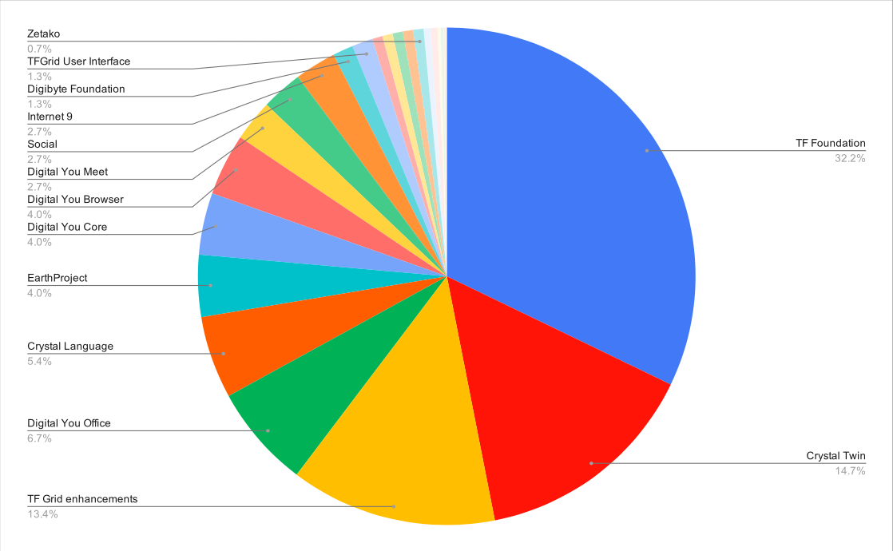

# Token Distribution Event for the ThreeFold Grid use cases

> **NOTE:** If you're interested in participating in the Token Distribution Event, please visit the Token section of this wiki, in particular "How to Buy."

> **IMPORTANT:** We believe the ThreeFold Token (TFT) value should not be based on speculation or velocity (usage on public exchanges).
Please buy this token only if you believe in future value of the TF Grid and wish to support projects building their solutions on top of the TF Grid.

> **IMPORTANT:** The TFT is NOT an investment instrument.
The TFT is ment to be a value of exchange on the TF Grid and is used to buy and sell IT capacity.

### Introduction

The TFT is the token of the new internet and has been created 2 years ago. Every token is the result of farming of Internet capacity and storage. 

We started our token on our own blockchain (Revine) but have now moved to the Stellar payment network.

ThreeFold Farmers have donated 70m TFT to ThreeFold Foundation.
Anyone who owns TF Tokens can donate it to TF Foundation that way supporting growth of the TF Grid. 

The Token Distribution Event is organized to benefit projects (listed below) which have as purpose to provide value to the ThreeFold movement building their solutions on top of ThreeFold Grid and by doing so serving our planet.

### Project Funding

You can buy ThreeFold Token (TFT) on 2 public exchanges (Liquid and BTC-Alpha), from existing farmers or through Stellar. By buying tokens, you directly support projects (listed below) and therefore the growth of the ThreeFold Grid and experiences built on top of it.

Its very easy to [buy TFT's](how_to_buy_and_sell.md) and as such become part of the larger ThreeFold ecosystem. 

### How Does It Work

You can [buy TFT's](how_to_buy_and_sell.md) during the Token Distribution Event where all received funds will be distributed according to the pie chart above.

> **NOTE:** On public exchanges the ThreeFold Foundation offers TFT's at 0.15USD, any other TFT owner can also sell at their own conditions.

There will be a maximum of 70m TFT available during the TDE proportionaly distributed between do-good projects (as per pie chart above).

> **IMPORTANT:** TFT's are NOT an investment instrument. This is NOT an ICO or IEO. All tokens are a result of previous farming (mining) activities done by the ThreeFold Farmers and sold on public exchanges (as for now public exchanges are still the only way to allow people to buy TFT's).

### Project Overview

For each project an amount of TFT's has been made available based on their upcoming milestones.

| Project Name | Amount Available | Description |
|:-------------|---------------:|:------------|
| [TF Foundation](foundation_proj.md) | 24,000,000		| Funding the ThreeFold Foundation (marketing, operations team, grid roll out..) |
| [Crystal Twin](crystaltwin.md) | 11,000,000		| 80% of our digital life implemented on top of the 3bot |
| [TF Grid Enhancements](gridenhancements.md) | 10,000,000		| Further improvements to the TF Grid as sponsored by the TF Foundation |
| [Digital You Office](digitalyouoffice.md) | 5,000,000		| 100% compatible office suite running on top of your 3bot |
| [Crystal Language](crystallang_proj.md) | 4,000,000		| Core language used to implement the 3bot and future SDK for the ThreeFold |
| [EarthProject](earthproject.md) | 3,000,000		| World's first true peer-to-peer education platform on top of the TF Grid |
| [Digital You Core](digitalyoucore.md) | 3,000,000		| Our personal cloud on the TF Grid |
| [Digital You Browser](digitalyoubrowser.md) | 3,000,000		| Personal browser running close to our 3bot |
| [Digital You Meet](digitalyoumeet.md) | 2,000,000		| Peer-to-peer video conferencing tool |
| [Social](social.md) | 2,000,000		| Exciting social network tool on top of the TF Grid / 3bot connect |
| [ThreeFoldNow](threefoldnow.md) |  2,000,000		| Open source solutions ported to the TF Grid |
| [Digibyte Foundation](digibytefoundaion.md) |  1,000,000		| Onboarding token for the ThreeFold Grid and go-to-market partner, integration in the TF Wallet |
| [TF Grid User Interface](griduserinterface.md) | 1,000,000		| Easy-to-use interface to provision IT workloads on the TF Grid |
| [Shareitt](shareitt.md) | 500,000		| Integration of Shareitt app on the TF Grid and Crystal Twin |
| [Vlinder](vlinder.md) | 500,000		| Personal planet first finance app on top of 3bot /Crystal Twin |
| [The Humanized Internet](thehumanizedinternet.md) | 500,000		| Digital identity for everyone running on top of the TF Grid / 3bot connect |
| [Artheon VR Museum](vrmuseum.md) | 500,000		| Virtual reality museum online with 500,000+ artworks as part of the TF Grid |
| [Zetako](zetako.md) | 500,000		| Integration of incredible lossless data compression technology on the TF Grid |
| [Beliive](timebank.md) | 333,333		| World first global time token, on top of the TF Grid, +200k users today |
| [Generation Blue](generationblue.md) | 333,333		| Tokenization of rainforests bult on top of the TF Grid, using CrystalTwin / the TF Wallet |
| [Unit](unit.md) | 150,000		| Integration of Unit technology on top of the TF Grid / 3bot, to empower small businesses |
| [Crystal Home](crystalhome.md) | 150,000		| Enable offgrid homes to use Crystal Twin and the TF Grid / 3bot |
| [Money of Good](moneyofgood.md) | 150,000		| Raising consciousness through meditation app built on top of the TF Grid |