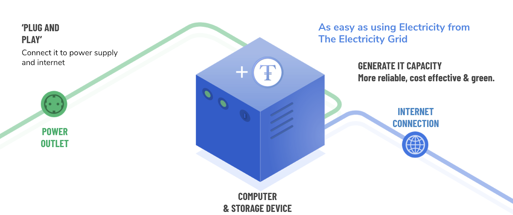
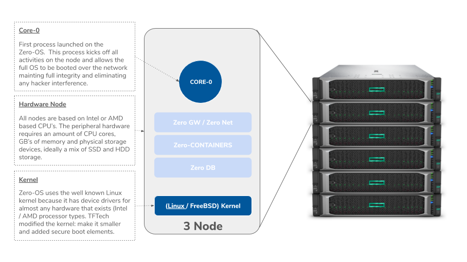
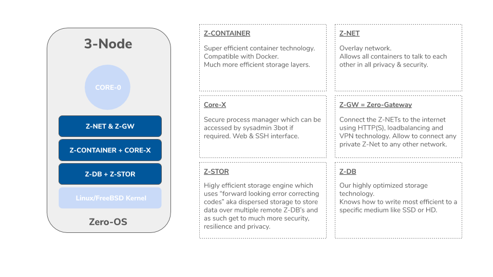

# The 3Node 

The 3Node is a physical box which is connected to the Internet or a local network. A 3Node can be deployed privately, as well as for high-security use cases. The 3Nodes deliver the required capacity for the TF Grid.

The 3Node boot process is ultra-safe and cannot be intercepted by hackers. It is designed in such a way that no person, not even ourselves, has access to the internals of the Zero-OS.

We do this by means of strong integration with the physical hardware security and boot capabilities (e.g. secure-boot). There is no shell in Zero-OS, no user interface, and no RPC layer (remote procedure call).

The only way how the Zero-OS can be commanded is by means of the Blockchain Database.

Core-0 is our main process manager which will deploy and manage our primitive workloads. There are three types of workloads: compute, storage, & network.