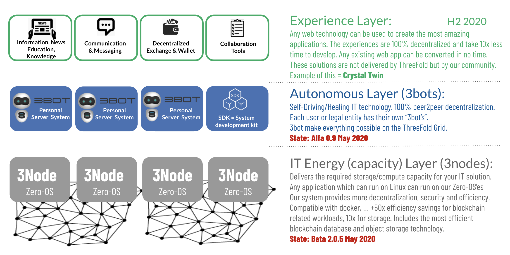

## The ThreeFold Layers

<!-- tabs:start -->
### **Capacity Layer**

**Delivers the required capacity for your IT solution.**

**Any application which can run on Linux can run on our Zero-OS’es.**

**Our system provides more decentralization, security, and efficiency.**

The capacity layer is the layer where CPU and Storage resources are delivered. It consists of hardware (storage/compute servers) and the TF Tech operating system called Zero-OS.

Zero-OS nodes are installed wherever capacity is required (e.g. at a base station for 5G applications, etc). Zero-OS has been designed from the bottom up. TF Tech started from a Linux kernel and secure boot BIOS – everything else in the operating system has been created from scratch. It delivers 3 primitive functions: storage capacity, compute capacity in the form of highly-optimized containers, and network capacity for running the network services.

This layer has no self-driving or self-healing capabilities – it is a layer of smart, efficient, and secure algorithms created with as little code as possible. The fewer lines of code the more security.

### **Autonomous Layer**

**Self-Driving and Self-Healing IT technology allows 100% decentralization.**

**Includes the most efficient blockchain database and object storage technology.**

**+50x efficiency savings for blockchain-related workloads, 10x for storage.**

**Each user or legal entity has its own "digital self."**

TF Tech’s solution allows for self-driving and self-healing workloads. This is possible because of an innovative decentralization technique. Each user or organization (e.g. company or department of the company) gets a digital avatar which we call a 3Bot. Example: each user in the 5G network will have his or her own 3Bot in complete safety and data privacy. The 3Bots are all registered on a modern type of phone book implemented using blockchain technology. This phone book allows all 3Bots to talk to each other (find each other) while securing communication (verify incoming traffic on authenticity and correctness). All these 3Bots run autonomously in the network created around them and in the base stations. There are no people involved to run this network and keep it operational. This is a very different way of thinking – it leads to much more security, efficiency, and higher performance. More specifically, this will lead to huge network savings and makes building large scale datacenters obsolete. The 3Bots know how to deploy IT and network capacity as required by the user or the company (self-driving) and they can also auto repair issues (self-healing). As an example, this technology can be used to implement any network service as required by a 5G operator.

### **Experiences Layer**

**Autonomous Decentralized Experience Layer.**

**Any web technology can be used to create the most amazing experiences.**

**The result is 100% decentralized and any experience developer need 10x less time to develop.**

The grid of 3Bots allows any experience to be developed with much more efficiency. With only two numbers, all information in the world can be addressed. The security is higher – for blockchain workloads, up to 50 times more network and storage efficiency can be achieved. The 3Bot API allows any chosen web technology (JavaScript frameworks) to very easily connect to the 3Bot for all backend services. This enables very easy creation of experiences (apps) for the 5G operator and end-users. This experience layer is delivered in the form of an SDK (System Development Kit) and has a lot of components pre-made like decentralized authentication, identity management, identity verification, video and audio conferencing, object storage, browser security (secure audited browser in browser technology), email services, and more.

<!-- tabs:end -->
