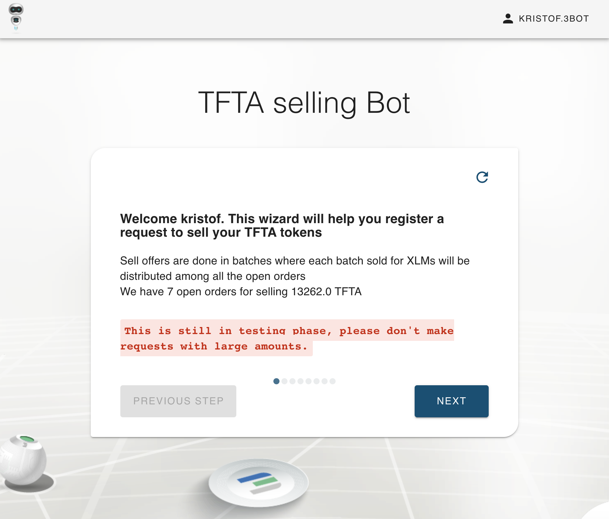
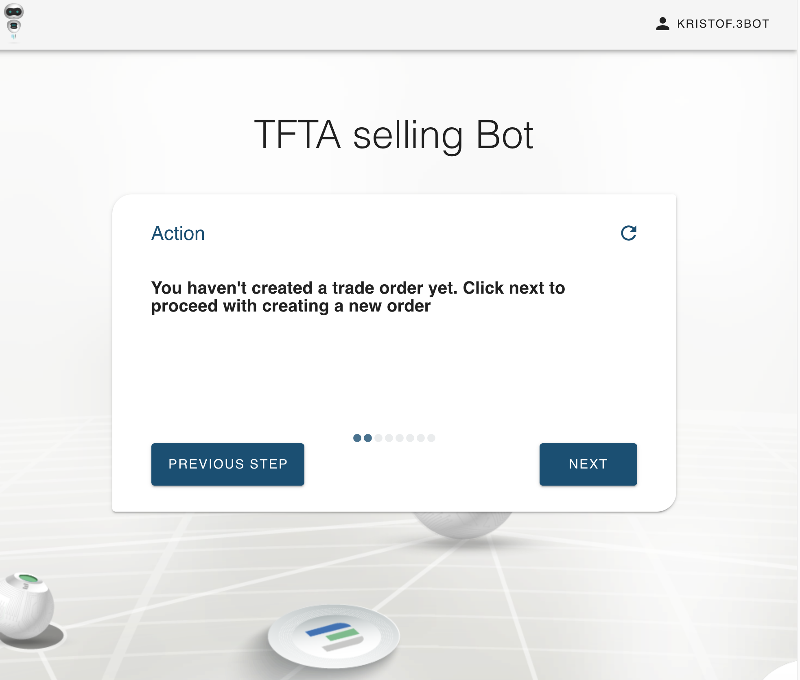
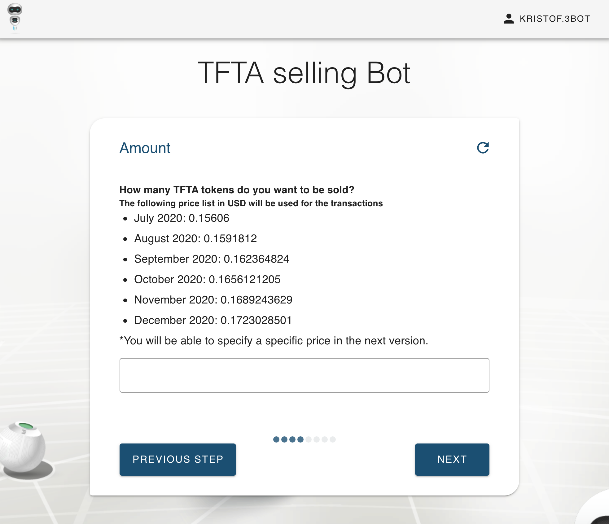
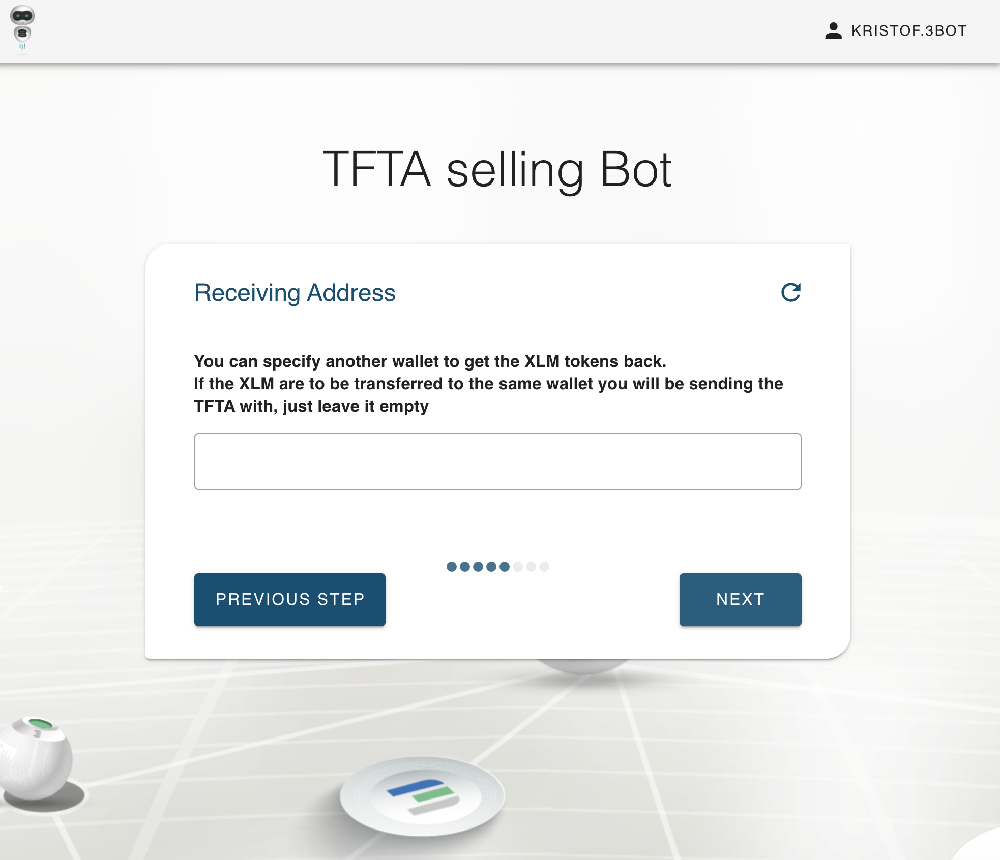
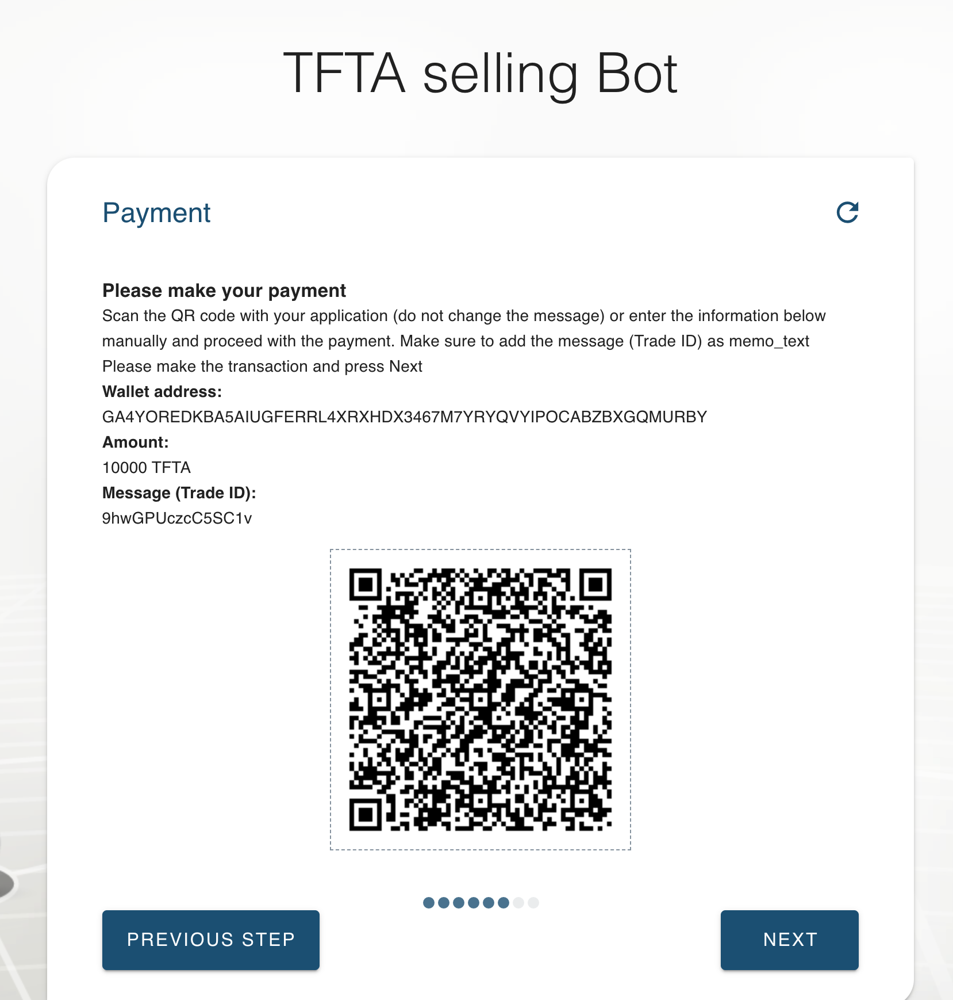
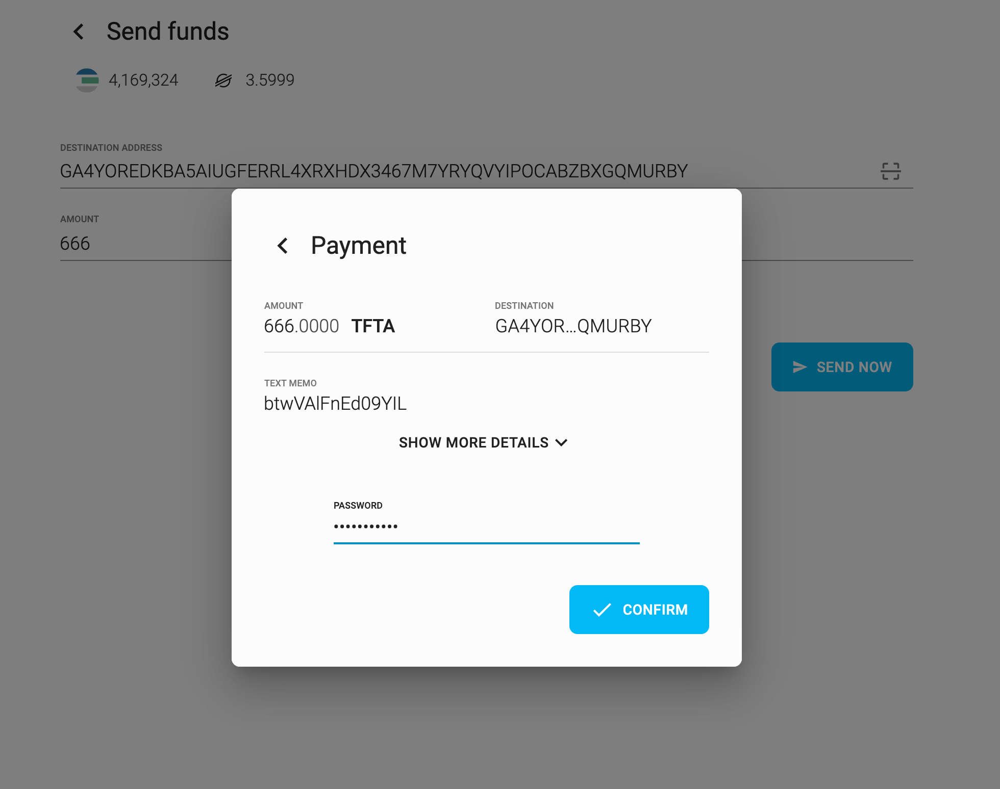
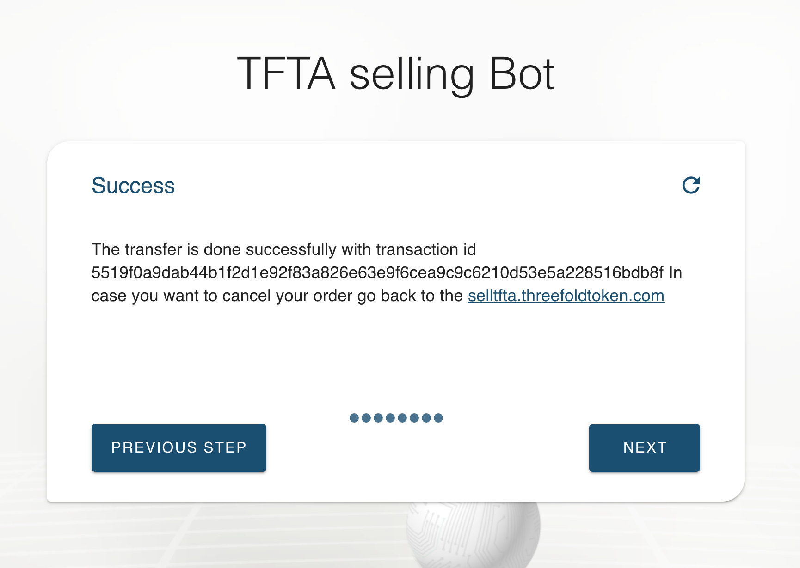

# Threefold Marketmaker Bot

While potentially the name is misleading, because this bot does not have funding to keep a market stable, 
this bot has as goal to allow any TFTv1 (TFTA) token holder to sell tokens to public exchanges while maintaining a minimum price.

> At time of writing +90% of our community has voted for this price protection.  
> TFFoundation has done everything possible to make sure NO TFTA holder can sell for prices lower than the minimum price.  
> Every TFTv1 holder has exactly the same conditions.  

The TFT bot market maker is a digitized bot operated by the ThreeFold Foundation (ThreeFold FZC). 

All TFTA holders can sell as much as they want on the Stellar, Liquid and BTCAlpha exchange through the TFT market maker bot as long as the price of the TFT is high enough & there is liquidity on the market. The marketmaker bot makes it very easy for everyone to sell.

The rules the bot maintains are as follows:

- Until the end of 2020 TFTA can only be sold if the sell price is higher than the min TFT price.
- Min TFT price by market maker is USD 0.15 starting April 29, going up 2% per month compared to the USD.

### tutorial

Specify the amount of TFTv1 (TFTA) you want to sell on one of the exchanges.

Normally no need to fill this in, the XLM will be send to the wallet you have used to sell your TFTA from.

Once the tokens arrive the order has been done.

In this example we use the Solar wallet to send the tokens.

The order has been done.

If you go back to the bot you will see an overview screen with the open trade order.
You can at any point cancel the trade.

### remarks

- The sales orders are always done versus XLM which is the native Stellar currency
- This means if someone wants to buy TFT for BTC, it will still work, Stellar payments network will convert to XLM and then to TFT. 
- The sales on BTCAlpha and Liquid are always converted back to XLM.

> Important note: TFTs are not an investment instrument. TFT's are used to buy/sell IT Capacity.
